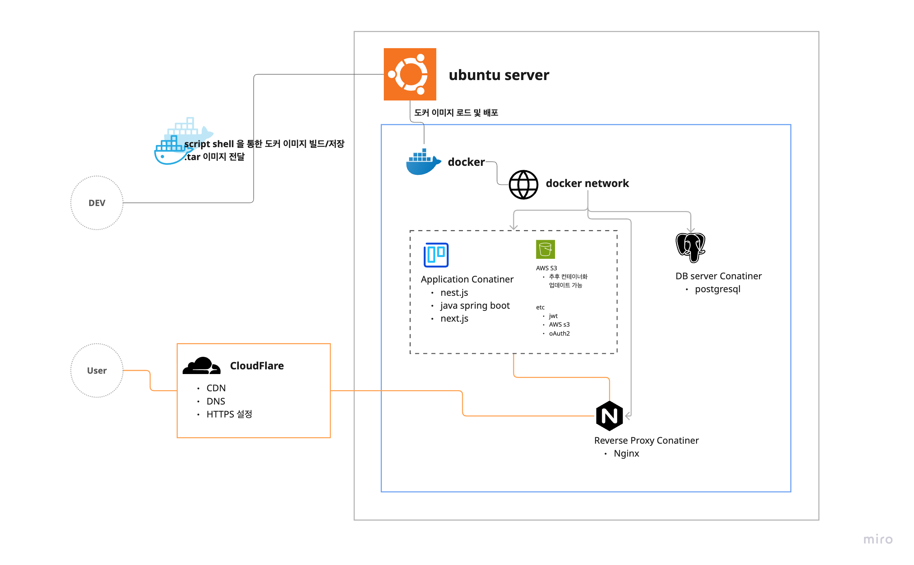

# Java SpringBoot

## 개요
학습을 위해 제작한 기본 아키텍처 템플릿입니다.
상황에 따라 필요한 기능을 유연하게 추가하거나 간소화할 수 있습니다.

## 기술 스택
- Java 22
- Spring Boot 3.3.13
- Spring Security
- Spring Data JPA
- PostgreSQL
- Lombok
- Validation

## 기타 정보
- **필수파일**: .env: 개발 환경변수, .env.deploy: 배포 환경변수

## 배포 및 운영환경
- 운영 환경: AWS EC2 (Docker + Nginx)
- 배포 주소: [https://java.upinnn.com/swagger-ui/index.html](https://java.upinnn.com/swagger-ui/index.html)

